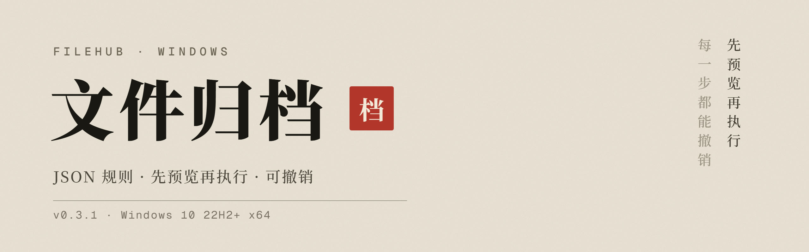

# FileHub Windows

 

**让 AI 帮你写归档规则，FileHub 照规则整理文件：先预览，再执行，做错了能撤销。**

 

规则是一份 JSON 文件，你把需求和编写指南交给任意 AI，它写好你再导入。 
每次处理前，先看清每个文件会被移到哪、改成什么名字，确认了才动手。 
处理过的批次都留在记录里，可以一键撤销。

[下载 0.3.1](https://github.com/Wanrd0Geri/filehub-windows/releases/tag/v0.3.1) · [能做什么](#能做什么) · [开始使用](#开始使用) · [安全设计](#安全设计) · [使用说明](docs/使用说明.md)

---

## 能做什么

| 功能 | 说明 |
|---|---|
| 按规则处理文件 | 移动、复制、重命名、放进子文件夹、转换图片；多个动作按顺序执行 |
| 右键多选打标签 | 在资源管理器里多选文件，右键用 FileHub 打开标签窗口，输入项目代码就能归档；最近用过的标签会保留 |
| 图片批量转换 | JPEG / PNG / WebP 互转或压缩，不需要规则；默认另存，不动原图 |
| 记录与撤销 | 每一批操作都有记录，成功写入的批次可以撤销 |
| 自动处理（默认关） | 你明确添加观察文件夹并启用规则后，新文件进来自动按规则处理 |

主界面只有五页：文件处理、规则文件、图片转换、记录、设置。全程离线，不需要 GitHub、AI 的 API Key 或任何联网服务。

从旧版升级后，在标签窗口里点一次「恢复手动标签归档」并确认，就能接着用；已输入的内容和历史标签都保留。个人项目归档用可选的 `filehub.archive.v1` 档案，细节见[使用说明](docs/使用说明.md)。

---

## 开始使用

1. **写规则。** 在「规则文件」页打开 [AI 规则编写指南](docs/AI规则编写指南.md)，连同你的整理需求一起交给任意 AI。把它返回的 JSON 存成 UTF-8 文件，导入 FileHub。
2. **绑定文件夹。** 规则里写的文件夹，在本机选一个真实目录绑定。绑定不会自动开始整理，导入的规则默认也是关的。
3. **预览再执行。** 在「文件处理」选文件、文件夹，或直接拖进来。先看每个文件匹配了哪条规则、按什么顺序处理、最后去哪，确认后点「开始处理」。没有规则匹配的文件不会被动。
4. **（可选）自动处理。** 在设置里添加观察文件夹，再在「规则文件」页启用规则。多条规则都匹配时，按规则文件的先后顺序取第一条；不会自动扩大到子文件夹。

要改规则，就改 JSON 文件，再用「替换」导入或从原文件重新载入；导入前会让你核对差异，之后要重新绑定和启用。改的时候保留文件 id 和规则 id。

---

## 安全设计

- **先预览后执行。** 预览里看到的目标名字就是最终名字。执行时如果源文件变了、目标被别的文件占了、或规则权限变了，会停下来要求重新预览。
- **不覆盖同名文件。** 目标已有同名文件时，接着现有的版本号往后编，比如已有 `图片-9.jpg` 就存成 `图片-10.jpg`。
- **图片默认另存。** 只有你明确选「原地替换（可撤销）」才替换原图，替换前会先备份原图。备份不会自动清理，记得留出磁盘空间。
- **权限都要单独打开。** 自动处理、手动标签归档、未匹配的文件进收件箱、清理，每一项都要你单独授权，默认全关。
- **安装和卸载不碰你的数据。** 安装器按当前用户安装，不自动启动；卸载不删设置、规则、队列、记录和你的文件。

**不支持：** 视频转换、动图、RAW / HDR、OCR、脚本，以及完整保留图片元数据。

---

## 安装与升级

1. 从 [0.3.1 发布页](https://github.com/Wanrd0Geri/filehub-windows/releases/tag/v0.3.1) 下载 `FileHub-0.3.1-windows-x64-setup.exe`，用同一页的 `SHA256SUMS.txt` 核对文件。
2. 如果装过旧版，先从托盘退出 FileHub，等正在进行的工作结束。
3. 运行安装包，勾选「添加当前用户右键」。已有的规则不用重写。

关掉主窗口后 FileHub 会继续在托盘运行。升级或卸载前，都先从托盘退出。

<b>测试与验证情况</b>（点开）

- 0.3.1 本地完整测试 859 项通过；打包后的 EXE 在隔离环境自检 35/35 项通过；独立核对了 56 个打包模块和 29 项指南检查。文件哈希、构建源码和验证时间见 [0.3.1 交付说明](docs/交付说明-0.3.1.md)。
- 安装器目标是 Windows 10 22H2 x64 及以上。以下情况还没验证：Windows 10 实机、全新虚拟机、真实的安装 / 升级 / 降级 / 卸载流程、Mac、真实的双机同步。
- `--demo` 和 `--self-test` 只用于隔离环境的工程验收，正常安装不提供演示入口。

---

## 文档

- [使用说明](docs/使用说明.md)
- [AI 规则编写指南](docs/AI规则编写指南.md)：编写指南、JSON Schema 和示例都可以离线单独使用
- [0.3.1 交付说明](docs/交付说明-0.3.1.md) · [0.3.0 交付说明](docs/交付说明-0.3.0.md)
- [开发与恢复备份](docs/开发与备份.md)
- [第三方许可](docs/第三方许可.md)

仓库不保存个人素材或本机状态。历史 0.2.x 的交付材料保留原样。
